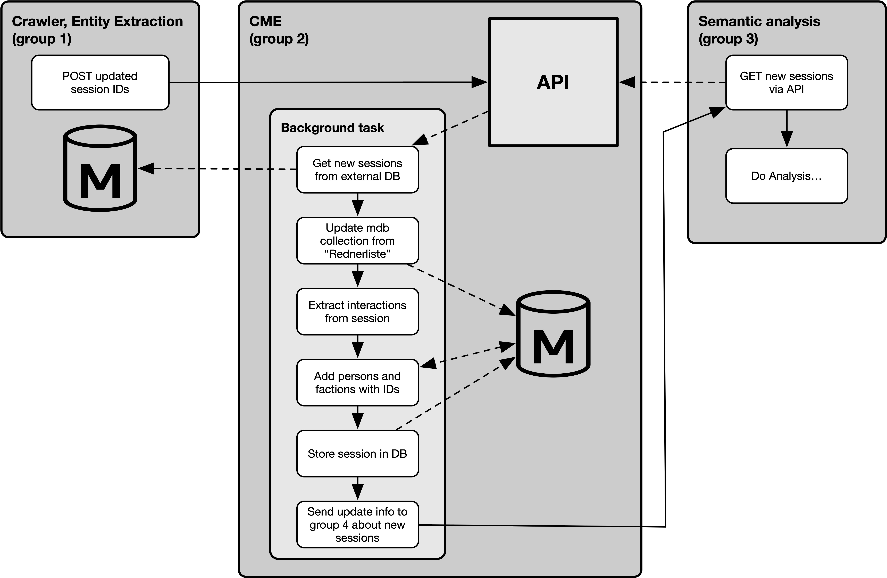

# Sentiments-of-Bundestag: Communication Model Extraction (CME)

**Group 2**: Kommunikationsmodell

We try to build a communication model out of the parsed XML data from Group 1.

This is pretty much work in progress. You can have a look into the examples folder to see what we are trying to archive.

The desired workflow with teams working before and after the communication model is shown here:



## Installation

The project is structured as an installable python package. Therefore it can be installed through pip and will install 
all needed dependencies in this case.

To install it you just have to clone the repo and run `pip install .`, but it should be noted that this will install the
cme and dependencies system wide and **can potentially break your system package manager**! If it is not desired to 
install it system wide it makes sense to build a python [venv](https://docs.python.org/3/library/venv.html) in which you
can safely install the package and needed other packages.

If you want to change the code it should also be noted that the package can be installed in the so called development 
mode. Doing so makes it possible to run changed code without having to reinstall the package to do so. To install it in 
dev mode just run `pip install -e .` in the root dir of the repository.

## Usage

After the installation `cme` should be an available executable and can than either be used in manual or server mode.

Manual mode allows you to convert input data from a file instead of waiting for a request to our REST API. The mode can 
be triggered by running: `cme manual` or `cme m`

In contrast to that the server mode will start up our REST API endpoints and will wait for requests from group 1 or 3 
to do anything. To run `cme` in server mode just run: `cme server` or `cme s`

Besides the two modes there are several flags which can be used to configure the behaviour of `cme`. To explore those 
just run `cme --help` or `cme -h`.

## API

Different endpoints:
* /cm/data/ - for getting notified about updated data and new sessions to evaluate
* /cm/data/session(s) - offer endpoints to retrieve our evaluated sessions containing a list of interactions between persons & factions 

## Database

- mongoDB
- install and start as a daemon, accessible through port 27017 
    mac: brew
    linux: systemctl
    

This project retrieves the protocols from another group via direct DB access. For that you will have to set the following environment variables:
```
export CRAWL_DB_USER=""
export CRAWL_DB_PASSWORD=""
export CRAWL_DB_IP=""
``` 

## Supporter

* Max Lüdemann
* Ralph Schlett
* Oskar Sailer
* Youri Seichter
